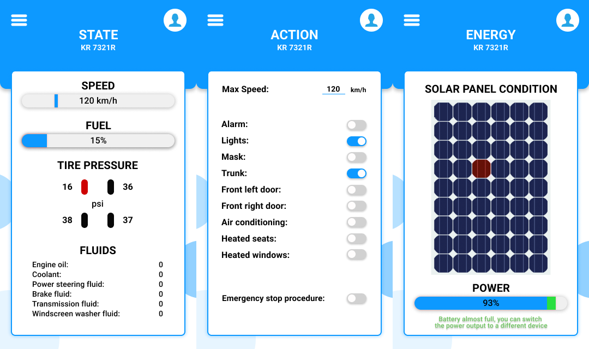
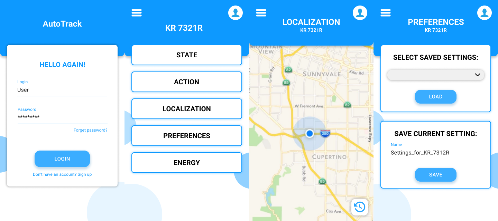

# AutoTrack

**AutoTrack** is our solution for remote car access. It allows to check the state of the car, take actions and locate the car.
 
## Motivation
AutoTrack was created at [HackAGH](https://hack.samorzad.agh.edu.pl/) Hackathon and got 🥉 3rd place.

- **Topic:** Stwórz rozwiązanie do zdalnej komunikacji z samochodem, które pozwoli właścicielowi podjąć wybraną akcję za pomocą np. smartfona czy kluczyków.
Przeprowadź symulację przykładowego zastosowania swojego rozwiązania w wybranej przez siebie sytuacji (np. kradzież pojazdu).
Twoje rozwiązanie powinno pokazywać bieżącą lokalizację i podstawowe informacje o pojeździe oraz umożliwić uruchomienie niektórych funkcji - może być to np. włączenie alarmu, świateł, a może ograniczenie maksymalnej prędkości, którą może poruszac się samochód?

- Timeframe: 22 April 2023, 12 hours

## Features

- Sign up and log in
- Check car state (speed, fuel, tire pressure and fluids)
- Take action (set max speed, open trunk, etc.)
- Check solar panel condition
- Locate the car
- Save and load user preferences

## Tech Stack

### Client
  

### Server (car imitation)
  

## Screenshots

## Authors

- [@BPajda](https://github.com/BPajda)
- [@MBrosik](https://github.com/MBrosik)
- [@MSiorr](https://github.com/MSiorr)
- [@rjodlowski](https://github.com/rjodlowski)
- [@rubikon02](https://github.com/rubikon02)

## License

This project is licensed under [MIT](./LICENSE) license.